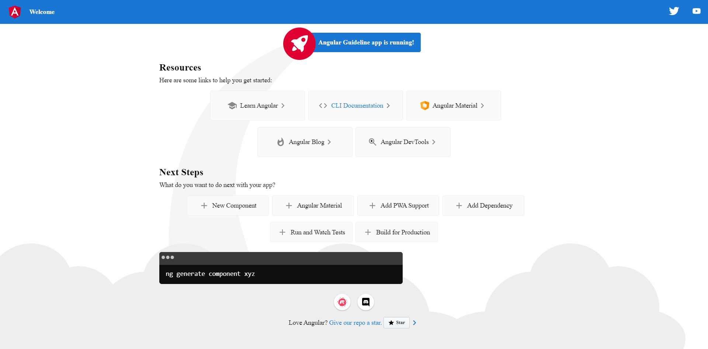

# Angular Guideline / Panduan Belajar Angular

This project was generated with [Angular CLI](https://github.com/angular/angular-cli) version 14.2.6.

## 1. Angular Component

### Sub Materi

1. Memahami konsep Angular component, seperti selector, template, dan style untuk component.
2. Memahami cara membuat component, template view untuk component, serta styling template component.
3. Memahami konsep Angular module import, exports, declaration, dan provider.
4. Memahami cara menggunakan component di component lainnya, sesuai dengan module-nya.
5. Memahami konsep Angular module forRoot dan forChild.
6. Memahami hirarki component di dalam Angular module.

#### 1. Memahami konsep Angular component, seperti selector, template, dan style untuk component.

`Component` adalah sebuah blok utama dari aplikasi Angular, karena diutamakan component sangat penting. Tiap component terdiri dari:

1. file `HTML` sebagai tampilan di web browser
2. file `css/scss` atau styling lain
3. file `TypeScript class` sebagai logic dari component tersebut dan berhubungan dengan file `html` dan `css`

Mari kita bedah file component yang sudah ada ketika membuat project baru Angular, yaitu `app.component.ts`.

```ts
import { Component } from "@angular/core";

@Component({
  selector: "app-root",
  templateUrl: "./app.component.html",
  styleUrls: ["./app.component.scss"],
})
export class AppComponent {
  title = "Angular Guideline";
}
```

Terdapat code `@Component` atau disebut sebagai decarator. Dekorator adalah pola desain yang digunakan untuk mengisolasi modifikasi atau dekorasi kelas tanpa memodifikasi kode sumber. Beberapa decorator lain pada Angular seperti `NgModule`, `@Inject` dan lain lain.

`@Component` menandakan bahwa class tersebut adalah sebuah component dan terdaftar sebagai component, di import langsung dari `@angular/core`. Dalam decorator component terdapat 3 bagian utama yaitu `selector`, `templateUrl` dan `styleUrls`.

Kita bahas `selector` dimana tiap component wajib di wakili oleh `CSS selector`. Selektor menginstruksikan Angular untuk membuat instance komponen terkait di mana pun ia menemukan tag yang sesuai di HTML template. Contoh kita mempunyai sebuah component `homepage.component.ts` di define dengan sebuah selector `app-homepage`. Selektor ini menginstruksikan Angular untuk membuat instance komponen ini setiap kali tag <app-homepage> muncul di template.

```ts
@Component({
    selector: 'app-homepage',
})
```

`Flashback` masih ingat pada prefix di pertemuan sebelumnya ? Ya, pada file `angular.json` terdapat prefix `app`, sehingga semua selector akan terdapat kata `app`.

Lanjut kita bahas component template. Jika kita perhatikan component template yang sudah ada adalah sebagai berikut.

```ts
@Component({
  selector: 'app-root',
  templateUrl: './app.component.html',
})
```

Terdapat kata `templateUrl` dan isinya adalah sebuah file html. Artinya ketika kita menggunakan `templateUrl` maka kita harus memanggil sebuah file html (wajib). Bagaimana jika tidak terdapat file html ? kita dapat menggunakan component template yang lain yaitu dengan keyword `template`. Bedanya apa ? perbedaan nya adalah isi nya. Jika `templateUrl` mengharuskan untuk memanggil file html jika `template` saja kita cukup menuliskan tag html nya. Sebagai contoh perhatikan potongan kode di bawah.

```ts
@Component({
  selector: 'app-root',
  template: '<h1>App Component</h1>',
})
```

1 baris diisi dengan tag html, apabila ingin lebih dari 1 baris kita ganti `"` dengan tanda backtick `` ` ``. Sebagai contoh perhatikan potongan kode di bawah.

```ts
@Component({
  selector: 'app-root',
  template: `
    <h1>Hello World!</h1>
    <p>This template definition spans multiple lines.</p>
  `
})
```

Lanjut kita bahas component style. Jika kita perhatikan component template yang sudah ada adalah sebagai berikut.

```ts
@Component({
  selector: 'app-root',
  templateUrl: './app.component.html',
  styleUrls: ['./app.component.scss']
})
```

Terdapat key `styleUrls` dan isinya adalah sebuah array. Isi sama dengan templateUrl yaitu sebuah file dan bisa diisi lebih dari 1 file style. Jika sebelumnya terdapat dua buah key yang dapat digunakan pada html pada style juga terdapat dua buah component style, pertama adalah `styleUrls` kedua adalah `style`. Penerapanya adalah sebagai berikut.

```ts
@Component({
  selector: 'app-root',
  template: '<h1>Hello World!</h1>',
  styles: ['h1 { font-weight: normal; }']
})
```

#### 2. Memahami cara membuat component, template view untuk component, serta styling template component.

Pembuatan component ada dua cara, pertama secara manual kedua kita bisa menggunakan command cli. Cara pertama kita bisa buat file baru dengan format `<component-name>.component.ts`. Selengkapnya sebagai berikut.

1. Buat file baru dengan nama `homepage.component.ts`.
2. Pada bagian atas jangan lupa lakukan import (_ini sebenarnya bisa otomatis import_)

   ```ts
   import { Component } from "@angular/core";
   ```

3. Setelah itu tambahkan `@Component` decorator.
   ```ts
   @Component({
   })
   ```
4. Pilih CSS selector yang diingkan (ini bisa bebas ya, tetapi tetap ikutin sesuai prefix saja).

   ```ts
   @Component({
      selector: 'app-homepage',
   })
   ```

5. Define HTML template disini kita menggunakan `templateUrl`. Buat dahulu file html dengan nama `homepage.component.html`.

   ```ts
   @Component({
      selector: 'app-homepage',
      templateUrl: './homepage.component.html',
   })
   ```

6. Bisa dibuat bisa tidak untuk component style dan jika di buat sesuaikan dengan konfigurasi styling yang digunakan pada `angular.json`. Buat dahulu file `homepage.component.scss`.

   ```ts
   @Component({
      selector: 'app-homepage',
      templateUrl: './homepage.component.html',
      styleUrls: ['./homepage.component.scss']
   })
   ```

7. Terakhir kita buat sebuah class sesuai dengan component yang kita buat yaitu `HomepageComponent`.
   ```ts
   export class HomepageComponent {}
   ```

Cara kedua adalah kita menggunakan command cli. Penggunaan command cli akan membuat sekaligus file diantaranya adalah `typescript class`, `html`, `scss` dan `spec` untuk unit testing. Semua file akan terbuat otomatis di dalam folder `src`. Siapkan terminal karena ini menggunakan command cli.

1. Membuat component untuk semua otomatis dapat `typescript class`, `html`, `scss` dan `spec`.

   ```bash
   ng generate component home
   ```

   hasilnya adalah sebagai berikut.

   ```bash
   CREATE src/app/home/home.component.html (19 bytes)
   CREATE src/app/home/home.component.spec.ts (585 bytes)
   CREATE src/app/home/home.component.ts (268 bytes)
   CREATE src/app/home/home.component.scss (0 bytes)
   UPDATE src/app/app.module.ts (611 bytes)
   ```

   Tiap membuat sebuah component dengan cara di atas command cli akan membuatkan terlebih dahulu folder dengan nama yang dibuat baru didalamnya terbuat 4 buah file dan yang paling terpening adalah component yang dibuat akan terdaftar di `module` kebetulan module yang ada disini adalah `app.module` (penjelasan tentang module akan di bahas kemudian).

2. Membuat component tanpa terbuat folder
   ```bash
   $ ng generate component home-page --flat
   CREATE src/app/home-page.component.html (24 bytes)
   CREATE src/app/home-page.component.spec.ts (614 bytes)
   CREATE src/app/home-page.component.ts (287 bytes)
   CREATE src/app/home-page.component.scss (0 bytes)
   UPDATE src/app/app.module.ts (693 bytes)
   ```
   Keyword `--flat` akan membuat file baru di tingkat atas proyek saat ini (root) project.
3. Membuat component tanpa file `spec`.

   ```bash
   $ ng generate component home-page --skip-tests
   CREATE src/app/home-page/home-page.component.html (24 bytes)
   CREATE src/app/home-page/home-page.component.ts (287 bytes)
   CREATE src/app/home-page/home-page.component.scss (0 bytes)
   ```

   Keyword `--skip-tests` tidak akan membuat file `spec.ts` pada componet baru yang dibuat.

Untuk latihan kita akan mencoba untuk memisahkan isi dari file `app.component.html` menjadi beberapa bagian dan jadikan sebagai component. Agar terlihat rapih silahkan masukkan semua component yang akan di buat kedalam folder `pages`.
Buat component berikut.

1. `headers` atau `toolbars` component.
2. `highlight-card` component.
3. `resources` component.
4. `next-steps` component.
5. `footer` component.

Mari kita buat.

```bash
ng generate component pages/headers --skip-tests
ng generate component pages/highlight-card --skip-tests
ng generate component pages/resources --skip-tests
ng generate component pages/next-steps --skip-tests
ng generate component pages/footer --skip-tests
```

Setelah itu kita mulai pindahkan.

1. File `headers.component.html` dengan isi berikut.

   ```html
   <div class="toolbar" role="banner">
     
     <span>Welcome</span>
     <div class="spacer"></div>
     <a
       aria-label="Angular on twitter"
       target="_blank"
       rel="noopener"
       href="https://twitter.com/angular"
       title="Twitter"
     >
       <svg
         id="twitter-logo"
         height="24"
         data-name="Logo"
         xmlns="http://www.w3.org/2000/svg"
         viewBox="0 0 400 400"
       >
         <rect width="400" height="400" fill="none" />
         <path
           d="M153.62,301.59c94.34,0,145.94-78.16,145.94-145.94,0-2.22,0-4.43-.15-6.63A104.36,104.36,0,0,0,325,122.47a102.38,102.38,0,0,1-29.46,8.07,51.47,51.47,0,0,0,22.55-28.37,102.79,102.79,0,0,1-32.57,12.45,51.34,51.34,0,0,0-87.41,46.78A145.62,145.62,0,0,1,92.4,107.81a51.33,51.33,0,0,0,15.88,68.47A50.91,50.91,0,0,1,85,169.86c0,.21,0,.43,0,.65a51.31,51.31,0,0,0,41.15,50.28,51.21,51.21,0,0,1-23.16.88,51.35,51.35,0,0,0,47.92,35.62,102.92,102.92,0,0,1-63.7,22A104.41,104.41,0,0,1,75,278.55a145.21,145.21,0,0,0,78.62,23"
           fill="#fff"
         />
       </svg>
     </a>
     <a
       aria-label="Angular on YouTube"
       target="_blank"
       rel="noopener"
       href="https://youtube.com/angular"
       title="YouTube"
     >
       <svg
         id="youtube-logo"
         height="24"
         width="24"
         data-name="Logo"
         xmlns="http://www.w3.org/2000/svg"
         viewBox="0 0 24 24"
         fill="#fff"
       >
         <path d="M0 0h24v24H0V0z" fill="none" />
         <path
           d="M21.58 7.19c-.23-.86-.91-1.54-1.77-1.77C18.25 5 12 5 12 5s-6.25 0-7.81.42c-.86.23-1.54.91-1.77 1.77C2 8.75 2 12 2 12s0 3.25.42 4.81c.23.86.91 1.54 1.77 1.77C5.75 19 12 19 12 19s6.25 0 7.81-.42c.86-.23 1.54-.91 1.77-1.77C22 15.25 22 12 22 12s0-3.25-.42-4.81zM10 15V9l5.2 3-5.2 3z"
         />
       </svg>
     </a>
   </div>
   ```

2. File `highlight-card.component.html` dengan isi berikut.

   ```html
   <div class="card highlight-card card-small">
     <svg
       id="rocket"
       xmlns="http://www.w3.org/2000/svg"
       width="101.678"
       height="101.678"
       viewBox="0 0 101.678 101.678"
     >
       <title>Rocket Ship</title>
       <g id="Group_83" data-name="Group 83" transform="translate(-141 -696)">
         <circle
           id="Ellipse_8"
           data-name="Ellipse 8"
           cx="50.839"
           cy="50.839"
           r="50.839"
           transform="translate(141 696)"
           fill="#dd0031"
         />
         <g
           id="Group_47"
           data-name="Group 47"
           transform="translate(165.185 720.185)"
         >
           <path
             id="Path_33"
             data-name="Path 33"
             d="M3.4,42.615a3.084,3.084,0,0,0,3.553,3.553,21.419,21.419,0,0,0,12.215-6.107L9.511,30.4A21.419,21.419,0,0,0,3.4,42.615Z"
             transform="translate(0.371 3.363)"
             fill="#fff"
           />
           <path
             id="Path_34"
             data-name="Path 34"
             d="M53.3,3.221A3.09,3.09,0,0,0,50.081,0,48.227,48.227,0,0,0,18.322,13.437c-6-1.666-14.991-1.221-18.322,7.218A33.892,33.892,0,0,1,9.439,25.1l-.333.666a3.013,3.013,0,0,0,.555,3.553L23.985,43.641a2.9,2.9,0,0,0,3.553.555l.666-.333A33.892,33.892,0,0,1,32.647,53.3c8.55-3.664,8.884-12.326,7.218-18.322A48.227,48.227,0,0,0,53.3,3.221ZM34.424,9.772a6.439,6.439,0,1,1,9.106,9.106,6.368,6.368,0,0,1-9.106,0A6.467,6.467,0,0,1,34.424,9.772Z"
             transform="translate(0 0.005)"
             fill="#fff"
           />
         </g>
       </g>
     </svg>

     <span>Angular Guideline app is running!</span>

     <svg
       id="rocket-smoke"
       xmlns="http://www.w3.org/2000/svg"
       width="516.119"
       height="1083.632"
       viewBox="0 0 516.119 1083.632"
     >
       <title>Rocket Ship Smoke</title>
       <path
         id="Path_40"
         data-name="Path 40"
         d="M644.6,141S143.02,215.537,147.049,870.207s342.774,201.755,342.774,201.755S404.659,847.213,388.815,762.2c-27.116-145.51-11.551-384.124,271.9-609.1C671.15,139.365,644.6,141,644.6,141Z"
         transform="translate(-147.025 -140.939)"
         fill="#f5f5f5"
       />
     </svg>
   </div>
   ```

3. File `resources` dengan isi berikut.

   ```html
   <h2>Resources</h2>
   <p>Here are some links to help you get started:</p>
   <div class="card-container">
     <a
       class="card"
       target="_blank"
       rel="noopener"
       href="https://angular.io/tutorial"
     >
       <svg
         class="material-icons"
         xmlns="http://www.w3.org/2000/svg"
         width="24"
         height="24"
         viewBox="0 0 24 24"
       >
         <path
           d="M5 13.18v4L12 21l7-3.82v-4L12 17l-7-3.82zM12 3L1 9l11 6 9-4.91V17h2V9L12 3z"
         />
       </svg>
       <span>Learn Angular</span>
       <svg
         class="material-icons"
         xmlns="http://www.w3.org/2000/svg"
         width="24"
         height="24"
         viewBox="0 0 24 24"
       >
         <path d="M10 6L8.59 7.41 13.17 12l-4.58 4.59L10 18l6-6z" />
       </svg>
     </a>

     <a
       class="card"
       target="_blank"
       rel="noopener"
       href="https://angular.io/cli"
     >
       <svg
         class="material-icons"
         xmlns="http://www.w3.org/2000/svg"
         width="24"
         height="24"
         viewBox="0 0 24 24"
       >
         <path
           d="M9.4 16.6L4.8 12l4.6-4.6L8 6l-6 6 6 6 1.4-1.4zm5.2 0l4.6-4.6-4.6-4.6L16 6l6 6-6 6-1.4-1.4z"
         />
       </svg>
       <span>CLI Documentation</span>
       <svg
         class="material-icons"
         xmlns="http://www.w3.org/2000/svg"
         width="24"
         height="24"
         viewBox="0 0 24 24"
       >
         <path d="M10 6L8.59 7.41 13.17 12l-4.58 4.59L10 18l6-6z" />
       </svg>
     </a>

     <a
       class="card"
       target="_blank"
       rel="noopener"
       href="https://material.angular.io"
     >
       <svg
         xmlns="http://www.w3.org/2000/svg"
         style="margin-right: 8px"
         width="21.813"
         height="23.453"
         viewBox="0 0 179.2 192.7"
       >
         <path
           fill="#ffa726"
           d="M89.4 0 0 32l13.5 118.4 75.9 42.3 76-42.3L179.2 32 89.4 0z"
         />
         <path fill="#fb8c00" d="M89.4 0v192.7l76-42.3L179.2 32 89.4 0z" />
         <path
           fill="#ffe0b2"
           d="m102.9 146.3-63.3-30.5 36.3-22.4 63.7 30.6-36.7 22.3z"
         />
         <path
           fill="#fff3e0"
           d="M102.9 122.8 39.6 92.2l36.3-22.3 63.7 30.6-36.7 22.3z"
         />
         <path
           fill="#fff"
           d="M102.9 99.3 39.6 68.7l36.3-22.4 63.7 30.6-36.7 22.4z"
         />
       </svg>
       <span>Angular Material</span>
       <svg
         class="material-icons"
         xmlns="http://www.w3.org/2000/svg"
         width="24"
         height="24"
         viewBox="0 0 24 24"
       >
         <path d="M10 6L8.59 7.41 13.17 12l-4.58 4.59L10 18l6-6z" />
       </svg>
     </a>

     <a
       class="card"
       target="_blank"
       rel="noopener"
       href="https://blog.angular.io/"
     >
       <svg
         class="material-icons"
         xmlns="http://www.w3.org/2000/svg"
         width="24"
         height="24"
         viewBox="0 0 24 24"
       >
         <path
           d="M13.5.67s.74 2.65.74 4.8c0 2.06-1.35 3.73-3.41 3.73-2.07 0-3.63-1.67-3.63-3.73l.03-.36C5.21 7.51 4 10.62 4 14c0 4.42 3.58 8 8 8s8-3.58 8-8C20 8.61 17.41 3.8 13.5.67zM11.71 19c-1.78 0-3.22-1.4-3.22-3.14 0-1.62 1.05-2.76 2.81-3.12 1.77-.36 3.6-1.21 4.62-2.58.39 1.29.59 2.65.59 4.04 0 2.65-2.15 4.8-4.8 4.8z"
         />
       </svg>
       <span>Angular Blog</span>
       <svg
         class="material-icons"
         xmlns="http://www.w3.org/2000/svg"
         width="24"
         height="24"
         viewBox="0 0 24 24"
       >
         <path d="M10 6L8.59 7.41 13.17 12l-4.58 4.59L10 18l6-6z" />
       </svg>
     </a>

     <a
       class="card"
       target="_blank"
       rel="noopener"
       href="https://angular.io/devtools/"
     >
       <svg
         class="material-icons"
         xmlns="http://www.w3.org/2000/svg"
         enable-background="new 0 0 24 24"
         height="24px"
         viewBox="0 0 24 24"
         width="24px"
         fill="#000000"
       >
         <g><rect fill="none" height="24" width="24" /></g>
         <g>
           <g>
             <path
               d="M14.73,13.31C15.52,12.24,16,10.93,16,9.5C16,5.91,13.09,3,9.5,3S3,5.91,3,9.5C3,13.09,5.91,16,9.5,16 c1.43,0,2.74-0.48,3.81-1.27L19.59,21L21,19.59L14.73,13.31z M9.5,14C7.01,14,5,11.99,5,9.5S7.01,5,9.5,5S14,7.01,14,9.5 S11.99,14,9.5,14z"
             />
             <polygon
               points="10.29,8.44 9.5,6 8.71,8.44 6.25,8.44 8.26,10.03 7.49,12.5 9.5,10.97 11.51,12.5 10.74,10.03 12.75,8.44"
             />
           </g>
         </g>
       </svg>
       <span>Angular DevTools</span>
       <svg
         class="material-icons"
         xmlns="http://www.w3.org/2000/svg"
         width="24"
         height="24"
         viewBox="0 0 24 24"
       >
         <path d="M10 6L8.59 7.41 13.17 12l-4.58 4.59L10 18l6-6z" />
       </svg>
     </a>
   </div>
   </div>
   ```

4. File `next-steps` isi dengan berikut.

   ```html
   <h2>Resources</h2>
   <p>Here are some links to help you get started:</p>

   <div class="card-container">
     <a
       class="card"
       target="_blank"
       rel="noopener"
       href="https://angular.io/tutorial"
     >
       <svg
         class="material-icons"
         xmlns="http://www.w3.org/2000/svg"
         width="24"
         height="24"
         viewBox="0 0 24 24"
       >
         <path
           d="M5 13.18v4L12 21l7-3.82v-4L12 17l-7-3.82zM12 3L1 9l11 6 9-4.91V17h2V9L12 3z"
         />
       </svg>
       <span>Learn Angular</span>
       <svg
         class="material-icons"
         xmlns="http://www.w3.org/2000/svg"
         width="24"
         height="24"
         viewBox="0 0 24 24"
       >
         <path d="M10 6L8.59 7.41 13.17 12l-4.58 4.59L10 18l6-6z" />
       </svg>
     </a>

     <a
       class="card"
       target="_blank"
       rel="noopener"
       href="https://angular.io/cli"
     >
       <svg
         class="material-icons"
         xmlns="http://www.w3.org/2000/svg"
         width="24"
         height="24"
         viewBox="0 0 24 24"
       >
         <path
           d="M9.4 16.6L4.8 12l4.6-4.6L8 6l-6 6 6 6 1.4-1.4zm5.2 0l4.6-4.6-4.6-4.6L16 6l6 6-6 6-1.4-1.4z"
         />
       </svg>
       <span>CLI Documentation</span>
       <svg
         class="material-icons"
         xmlns="http://www.w3.org/2000/svg"
         width="24"
         height="24"
         viewBox="0 0 24 24"
       >
         <path d="M10 6L8.59 7.41 13.17 12l-4.58 4.59L10 18l6-6z" />
       </svg>
     </a>

     <a
       class="card"
       target="_blank"
       rel="noopener"
       href="https://material.angular.io"
     >
       <svg
         xmlns="http://www.w3.org/2000/svg"
         style="margin-right: 8px"
         width="21.813"
         height="23.453"
         viewBox="0 0 179.2 192.7"
       >
         <path
           fill="#ffa726"
           d="M89.4 0 0 32l13.5 118.4 75.9 42.3 76-42.3L179.2 32 89.4 0z"
         />
         <path fill="#fb8c00" d="M89.4 0v192.7l76-42.3L179.2 32 89.4 0z" />
         <path
           fill="#ffe0b2"
           d="m102.9 146.3-63.3-30.5 36.3-22.4 63.7 30.6-36.7 22.3z"
         />
         <path
           fill="#fff3e0"
           d="M102.9 122.8 39.6 92.2l36.3-22.3 63.7 30.6-36.7 22.3z"
         />
         <path
           fill="#fff"
           d="M102.9 99.3 39.6 68.7l36.3-22.4 63.7 30.6-36.7 22.4z"
         />
       </svg>
       <span>Angular Material</span>
       <svg
         class="material-icons"
         xmlns="http://www.w3.org/2000/svg"
         width="24"
         height="24"
         viewBox="0 0 24 24"
       >
         <path d="M10 6L8.59 7.41 13.17 12l-4.58 4.59L10 18l6-6z" />
       </svg>
     </a>

     <a
       class="card"
       target="_blank"
       rel="noopener"
       href="https://blog.angular.io/"
     >
       <svg
         class="material-icons"
         xmlns="http://www.w3.org/2000/svg"
         width="24"
         height="24"
         viewBox="0 0 24 24"
       >
         <path
           d="M13.5.67s.74 2.65.74 4.8c0 2.06-1.35 3.73-3.41 3.73-2.07 0-3.63-1.67-3.63-3.73l.03-.36C5.21 7.51 4 10.62 4 14c0 4.42 3.58 8 8 8s8-3.58 8-8C20 8.61 17.41 3.8 13.5.67zM11.71 19c-1.78 0-3.22-1.4-3.22-3.14 0-1.62 1.05-2.76 2.81-3.12 1.77-.36 3.6-1.21 4.62-2.58.39 1.29.59 2.65.59 4.04 0 2.65-2.15 4.8-4.8 4.8z"
         />
       </svg>
       <span>Angular Blog</span>
       <svg
         class="material-icons"
         xmlns="http://www.w3.org/2000/svg"
         width="24"
         height="24"
         viewBox="0 0 24 24"
       >
         <path d="M10 6L8.59 7.41 13.17 12l-4.58 4.59L10 18l6-6z" />
       </svg>
     </a>

     <a
       class="card"
       target="_blank"
       rel="noopener"
       href="https://angular.io/devtools/"
     >
       <svg
         class="material-icons"
         xmlns="http://www.w3.org/2000/svg"
         enable-background="new 0 0 24 24"
         height="24px"
         viewBox="0 0 24 24"
         width="24px"
         fill="#000000"
       >
         <g><rect fill="none" height="24" width="24" /></g>
         <g>
           <g>
             <path
               d="M14.73,13.31C15.52,12.24,16,10.93,16,9.5C16,5.91,13.09,3,9.5,3S3,5.91,3,9.5C3,13.09,5.91,16,9.5,16 c1.43,0,2.74-0.48,3.81-1.27L19.59,21L21,19.59L14.73,13.31z M9.5,14C7.01,14,5,11.99,5,9.5S7.01,5,9.5,5S14,7.01,14,9.5 S11.99,14,9.5,14z"
             />
             <polygon
               points="10.29,8.44 9.5,6 8.71,8.44 6.25,8.44 8.26,10.03 7.49,12.5 9.5,10.97 11.51,12.5 10.74,10.03 12.75,8.44"
             />
           </g>
         </g>
       </svg>
       <span>Angular DevTools</span>
       <svg
         class="material-icons"
         xmlns="http://www.w3.org/2000/svg"
         width="24"
         height="24"
         viewBox="0 0 24 24"
       >
         <path d="M10 6L8.59 7.41 13.17 12l-4.58 4.59L10 18l6-6z" />
       </svg>
     </a>
   </div>
   ```

5. File `footer` isi dengan berikut.

   ```html
   <footer>
     Love Angular?&nbsp;
     <a
       href="https://github.com/angular/angular"
       target="_blank"
       rel="noopener"
     >
       Give our repo a star.
       <div class="github-star-badge">
         <svg
           class="material-icons"
           xmlns="http://www.w3.org/2000/svg"
           width="24"
           height="24"
           viewBox="0 0 24 24"
         >
           <path d="M0 0h24v24H0z" fill="none" />
           <path
             d="M12 17.27L18.18 21l-1.64-7.03L22 9.24l-7.19-.61L12 2 9.19 8.63 2 9.24l5.46 4.73L5.82 21z"
           />
         </svg>
         Star
       </div>
     </a>
     <a
       href="https://github.com/angular/angular"
       target="_blank"
       rel="noopener"
     >
       <svg
         class="material-icons"
         xmlns="http://www.w3.org/2000/svg"
         width="24"
         height="24"
         viewBox="0 0 24 24"
       >
         <path
           d="M10 6L8.59 7.41 13.17 12l-4.58 4.59L10 18l6-6z"
           fill="#1976d2"
         />
         <path d="M0 0h24v24H0z" fill="none" />
       </svg>
     </a>
   </footer>
   ```

6. Untuk styling kita taruh semua saja di styling global yaitu di `src/styles.scss`

   ```scss
   :host {
     font-family: -apple-system, BlinkMacSystemFont, "Segoe UI", Roboto,
       Helvetica, Arial, sans-serif, "Apple Color Emoji", "Segoe UI Emoji",
       "Segoe UI Symbol";
     font-size: 14px;
     color: #333;
     box-sizing: border-box;
     -webkit-font-smoothing: antialiased;
     -moz-osx-font-smoothing: grayscale;
   }

   h1,
   h2,
   h3,
   h4,
   h5,
   h6 {
     margin: 8px 0;
   }

   p {
     margin: 0;
   }

   .spacer {
     flex: 1;
   }

   .toolbar {
     position: absolute;
     top: 0;
     left: 0;
     right: 0;
     height: 60px;
     display: flex;
     align-items: center;
     background-color: #1976d2;
     color: white;
     font-weight: 600;
   }

   .toolbar img {
     margin: 0 16px;
   }

   .toolbar #twitter-logo {
     height: 40px;
     margin: 0 8px;
   }

   .toolbar #youtube-logo {
     height: 40px;
     margin: 0 16px;
   }

   .toolbar #twitter-logo:hover,
   .toolbar #youtube-logo:hover {
     opacity: 0.8;
   }

   .content {
     display: flex;
     margin: 82px auto 32px;
     padding: 0 16px;
     max-width: 960px;
     flex-direction: column;
     align-items: center;
   }

   svg.material-icons {
     height: 24px;
     width: auto;
   }

   svg.material-icons:not(:last-child) {
     margin-right: 8px;
   }

   .card svg.material-icons path {
     fill: #888;
   }

   .card-container {
     display: flex;
     flex-wrap: wrap;
     justify-content: center;
     margin-top: 16px;
   }

   .card {
     all: unset;
     border-radius: 4px;
     border: 1px solid #eee;
     background-color: #fafafa;
     height: 40px;
     width: 200px;
     margin: 0 8px 16px;
     padding: 16px;
     display: flex;
     flex-direction: row;
     justify-content: center;
     align-items: center;
     transition: all 0.2s ease-in-out;
     line-height: 24px;
   }

   .card-container .card:not(:last-child) {
     margin-right: 0;
   }

   .card.card-small {
     height: 16px;
     width: 168px;
   }

   .card-container .card:not(.highlight-card) {
     cursor: pointer;
   }

   .card-container .card:not(.highlight-card):hover {
     transform: translateY(-3px);
     box-shadow: 0 4px 17px rgba(0, 0, 0, 0.35);
   }

   .card-container .card:not(.highlight-card):hover .material-icons path {
     fill: rgb(105, 103, 103);
   }

   .card.highlight-card {
     background-color: #1976d2;
     color: white;
     font-weight: 600;
     border: none;
     width: auto;
     min-width: 30%;
     position: relative;
   }

   .card.card.highlight-card span {
     margin-left: 60px;
   }

   svg#rocket {
     width: 80px;
     position: absolute;
     left: -10px;
     top: -24px;
   }

   svg#rocket-smoke {
     height: calc(100vh - 95px);
     position: absolute;
     top: 10px;
     right: 180px;
     z-index: -10;
   }

   a,
   a:visited,
   a:hover {
     color: #1976d2;
     text-decoration: none;
   }

   a:hover {
     color: #125699;
   }

   .terminal {
     position: relative;
     width: 80%;
     max-width: 600px;
     border-radius: 6px;
     padding-top: 45px;
     margin-top: 8px;
     overflow: hidden;
     background-color: rgb(15, 15, 16);
   }

   .terminal::before {
     content: "\2022 \2022 \2022";
     position: absolute;
     top: 0;
     left: 0;
     height: 4px;
     background: rgb(58, 58, 58);
     color: #c2c3c4;
     width: 100%;
     font-size: 2rem;
     line-height: 0;
     padding: 14px 0;
     text-indent: 4px;
   }

   .terminal pre {
     font-family: SFMono-Regular, Consolas, Liberation Mono, Menlo, monospace;
     color: white;
     padding: 0 1rem 1rem;
     margin: 0;
   }

   .circle-link {
     height: 40px;
     width: 40px;
     border-radius: 40px;
     margin: 8px;
     background-color: white;
     border: 1px solid #eeeeee;
     display: flex;
     justify-content: center;
     align-items: center;
     cursor: pointer;
     box-shadow: 0 1px 3px rgba(0, 0, 0, 0.12), 0 1px 2px rgba(0, 0, 0, 0.24);
     transition: 1s ease-out;
   }

   .circle-link:hover {
     transform: translateY(-0.25rem);
     box-shadow: 0px 3px 15px rgba(0, 0, 0, 0.2);
   }

   footer {
     margin-top: 8px;
     display: flex;
     align-items: center;
     line-height: 20px;
   }

   footer a {
     display: flex;
     align-items: center;
   }

   .github-star-badge {
     color: #24292e;
     display: flex;
     align-items: center;
     font-size: 12px;
     padding: 3px 10px;
     border: 1px solid rgba(27, 31, 35, 0.2);
     border-radius: 3px;
     background-image: linear-gradient(-180deg, #fafbfc, #eff3f6 90%);
     margin-left: 4px;
     font-weight: 600;
   }

   .github-star-badge:hover {
     background-image: linear-gradient(-180deg, #f0f3f6, #e6ebf1 90%);
     border-color: rgba(27, 31, 35, 0.35);
     background-position: -0.5em;
   }

   .github-star-badge .material-icons {
     height: 16px;
     width: 16px;
     margin-right: 4px;
   }

   svg#clouds {
     position: fixed;
     bottom: -160px;
     left: -230px;
     z-index: -10;
     width: 1920px;
   }

   /* Responsive Styles */
   @media screen and (max-width: 767px) {
     .card-container > *:not(.circle-link),
     .terminal {
       width: 100%;
     }

     .card:not(.highlight-card) {
       height: 16px;
       margin: 8px 0;
     }

     .card.highlight-card span {
       margin-left: 72px;
     }

     svg#rocket-smoke {
       right: 120px;
       transform: rotate(-5deg);
     }
   }

   @media screen and (max-width: 575px) {
     svg#rocket-smoke {
       display: none;
       visibility: hidden;
     }
   }
   ```

Hasilnya seperti apa ? akan di bahas pada materi selanjutnya.

#### 3. Memahami konsep Angular module import, exports, declaration, dan provider.

Menyambung materi sebelumnya tentang bagaimana hasil dari pemisahan component. Perlu di ingat tiap kita membuat sebuah component baik secara manual maupun generate melalui command cli kita perlu mendaftarkannya di `module`. Module sendiri pada Angular di tandai dengan decorator `@NgModule`. Pada `module` mewakili beberapa `component` yang ada. Contoh ketika kita membuat sebuah component `app.component.ts` maka akan terdapat sebuah `app.module.ts`, tetapi perlu di ingat dalam 1 `module` dapat diisi dengan beberapa component atau satu component saja tergantung project yang akan di buat.

Informasi saja untuk pembagian module baiknya adalah tiap 1 tujuan atau fitur.

Topik ini kita akan melihat lebih jelas apa yang ada di `module`. Saat project angular di buat kita akan mendapatkan sebuah 1 buah module utama yaitu `app.module`, buka file `app.module.ts` untuk melihat isinya.

```ts
@NgModule({
  declarations: [
    AppComponent,
    SampleComponentComponent,
    SampleDirectiveDirective,
    HomeComponent,
    HomePageComponent,
    HeadersComponent,
    HighlightCardComponent,
    ResourcesComponent,
    NextStepsComponent,
    FooterComponent,
  ],
  imports: [BrowserModule],
  providers: [],
  bootstrap: [AppComponent],
})
export class AppModule {}
```

Terdapat 4 bagian penting di dalam sebuah file di atas yaitu `declarations`, `imports`, `providers` dan `bootstrap` namun sebenernya ada 1 buah properti lagi yaitu `exports`.

1. `declarations` adalah tempat mendaftarkan `component`, `directives`, dan `pipes` yang ada di bawah module tersebut.
2. `imports` menggunakan module lain yang didalamnya terdapat sebuah component (tetapi ini perlu di `exports`)
3. `exports` bagian untuk mendeklarasikan sebuah `component`, `direvtives` dan `pipes` yang akna di gunakan di module lain.
4. `providers` untuk kebutuhan service atau memanggil class dengan decorator `@Inject` (akan di bahas pada topik terkait).
5. `bootstrap` tampilan aplikasi utama, yang disebut komponen root, yang menampung semua tampilan aplikasi lainnya. Hanya root NgModule yang harus mengatur properti bootstrap.

Kembali lagi bagaimana hasilnya ketika sudah di pisah oleh beberapa component ? Pertama kita lakukan pemanggilan pada file `app.component.html` untuk setiap component yang sudah di buat sebelumnya.

Buka file `app.component.html` dan buat seperti di bawah ini.

```html
<app-headers></app-headers>

<div class="content" role="main">
  <app-highlight-card></app-highlight-card>

  <app-resources></app-resources>

  <app-next-steps></app-next-steps>

  <app-footer></app-footer>

  <svg
    id="clouds"
    xmlns="http://www.w3.org/2000/svg"
    width="2611.084"
    height="485.677"
    viewBox="0 0 2611.084 485.677"
  >
    <title>Gray Clouds Background</title>
    <path
      id="Path_39"
      data-name="Path 39"
      d="M2379.709,863.793c10-93-77-171-168-149-52-114-225-105-264,15-75,3-140,59-152,133-30,2.83-66.725,9.829-93.5,26.25-26.771-16.421-63.5-23.42-93.5-26.25-12-74-77-130-152-133-39-120-212-129-264-15-54.084-13.075-106.753,9.173-138.488,48.9-31.734-39.726-84.4-61.974-138.487-48.9-52-114-225-105-264,15a162.027,162.027,0,0,0-103.147,43.044c-30.633-45.365-87.1-72.091-145.206-58.044-52-114-225-105-264,15-75,3-140,59-152,133-53,5-127,23-130,83-2,42,35,72,70,86,49,20,106,18,157,5a165.625,165.625,0,0,0,120,0c47,94,178,113,251,33,61.112,8.015,113.854-5.72,150.492-29.764a165.62,165.62,0,0,0,110.861-3.236c47,94,178,113,251,33,31.385,4.116,60.563,2.495,86.487-3.311,25.924,5.806,55.1,7.427,86.488,3.311,73,80,204,61,251-33a165.625,165.625,0,0,0,120,0c51,13,108,15,157-5a147.188,147.188,0,0,0,33.5-18.694,147.217,147.217,0,0,0,33.5,18.694c49,20,106,18,157,5a165.625,165.625,0,0,0,120,0c47,94,178,113,251,33C2446.709,1093.793,2554.709,922.793,2379.709,863.793Z"
      transform="translate(142.69 -634.312)"
      fill="#eee"
    />
  </svg>
</div>
```

Kemudian untuk styling nya pindahkan semua di `src/styles.scss` seperti berikut.

```scss
:host {
  font-family: -apple-system, BlinkMacSystemFont, "Segoe UI", Roboto, Helvetica,
    Arial, sans-serif, "Apple Color Emoji", "Segoe UI Emoji", "Segoe UI Symbol";
  font-size: 14px;
  color: #333;
  box-sizing: border-box;
  -webkit-font-smoothing: antialiased;
  -moz-osx-font-smoothing: grayscale;
}

h1,
h2,
h3,
h4,
h5,
h6 {
  margin: 8px 0;
}

p {
  margin: 0;
}

.spacer {
  flex: 1;
}

.toolbar {
  position: absolute;
  top: 0;
  left: 0;
  right: 0;
  height: 60px;
  display: flex;
  align-items: center;
  background-color: #1976d2;
  color: white;
  font-weight: 600;
}

.toolbar img {
  margin: 0 16px;
}

.toolbar #twitter-logo {
  height: 40px;
  margin: 0 8px;
}

.toolbar #youtube-logo {
  height: 40px;
  margin: 0 16px;
}

.toolbar #twitter-logo:hover,
.toolbar #youtube-logo:hover {
  opacity: 0.8;
}

.content {
  display: flex;
  margin: 82px auto 32px;
  padding: 0 16px;
  max-width: 960px;
  flex-direction: column;
  align-items: center;
}

svg.material-icons {
  height: 24px;
  width: auto;
}

svg.material-icons:not(:last-child) {
  margin-right: 8px;
}

.card svg.material-icons path {
  fill: #888;
}

.card-container {
  display: flex;
  flex-wrap: wrap;
  justify-content: center;
  margin-top: 16px;
}

.card {
  all: unset;
  border-radius: 4px;
  border: 1px solid #eee;
  background-color: #fafafa;
  height: 40px;
  width: 200px;
  margin: 0 8px 16px;
  padding: 16px;
  display: flex;
  flex-direction: row;
  justify-content: center;
  align-items: center;
  transition: all 0.2s ease-in-out;
  line-height: 24px;
}

.card-container .card:not(:last-child) {
  margin-right: 0;
}

.card.card-small {
  height: 16px;
  width: 168px;
}

.card-container .card:not(.highlight-card) {
  cursor: pointer;
}

.card-container .card:not(.highlight-card):hover {
  transform: translateY(-3px);
  box-shadow: 0 4px 17px rgba(0, 0, 0, 0.35);
}

.card-container .card:not(.highlight-card):hover .material-icons path {
  fill: rgb(105, 103, 103);
}

.card.highlight-card {
  background-color: #1976d2;
  color: white;
  font-weight: 600;
  border: none;
  width: auto;
  min-width: 30%;
  position: relative;
}

.card.card.highlight-card span {
  margin-left: 60px;
}

svg#rocket {
  width: 80px;
  position: absolute;
  left: -10px;
  top: -24px;
}

svg#rocket-smoke {
  height: calc(100vh - 95px);
  position: absolute;
  top: 10px;
  right: 180px;
  z-index: -10;
}

a,
a:visited,
a:hover {
  color: #1976d2;
  text-decoration: none;
}

a:hover {
  color: #125699;
}

.terminal {
  position: relative;
  width: 80%;
  max-width: 600px;
  border-radius: 6px;
  padding-top: 45px;
  margin-top: 8px;
  overflow: hidden;
  background-color: rgb(15, 15, 16);
}

.terminal::before {
  content: "\2022 \2022 \2022";
  position: absolute;
  top: 0;
  left: 0;
  height: 4px;
  background: rgb(58, 58, 58);
  color: #c2c3c4;
  width: 100%;
  font-size: 2rem;
  line-height: 0;
  padding: 14px 0;
  text-indent: 4px;
}

.terminal pre {
  font-family: SFMono-Regular, Consolas, Liberation Mono, Menlo, monospace;
  color: white;
  padding: 0 1rem 1rem;
  margin: 0;
}

.circle-link {
  height: 40px;
  width: 40px;
  border-radius: 40px;
  margin: 8px;
  background-color: white;
  border: 1px solid #eeeeee;
  display: flex;
  justify-content: center;
  align-items: center;
  cursor: pointer;
  box-shadow: 0 1px 3px rgba(0, 0, 0, 0.12), 0 1px 2px rgba(0, 0, 0, 0.24);
  transition: 1s ease-out;
}

.circle-link:hover {
  transform: translateY(-0.25rem);
  box-shadow: 0px 3px 15px rgba(0, 0, 0, 0.2);
}

footer {
  margin-top: 8px;
  display: flex;
  align-items: center;
  line-height: 20px;
}

footer a {
  display: flex;
  align-items: center;
}

.github-star-badge {
  color: #24292e;
  display: flex;
  align-items: center;
  font-size: 12px;
  padding: 3px 10px;
  border: 1px solid rgba(27, 31, 35, 0.2);
  border-radius: 3px;
  background-image: linear-gradient(-180deg, #fafbfc, #eff3f6 90%);
  margin-left: 4px;
  font-weight: 600;
}

.github-star-badge:hover {
  background-image: linear-gradient(-180deg, #f0f3f6, #e6ebf1 90%);
  border-color: rgba(27, 31, 35, 0.35);
  background-position: -0.5em;
}

.github-star-badge .material-icons {
  height: 16px;
  width: 16px;
  margin-right: 4px;
}

svg#clouds {
  position: fixed;
  bottom: -160px;
  left: -230px;
  z-index: -10;
  width: 1920px;
}

/* Responsive Styles */
@media screen and (max-width: 767px) {
  .card-container > *:not(.circle-link),
  .terminal {
    width: 100%;
  }

  .card:not(.highlight-card) {
    height: 16px;
    margin: 8px 0;
  }

  .card.highlight-card span {
    margin-left: 72px;
  }

  svg#rocket-smoke {
    right: 120px;
    transform: rotate(-5deg);
  }
}

@media screen and (max-width: 575px) {
  svg#rocket-smoke {
    display: none;
    visibility: hidden;
  }
}
```

Coba sekarang jalankan aplikasi dengan perintah `ng serve --open` dan lihat hasilnya.


Sampai sini kamu telah berhasil membuat sebuah component dan memahami cara pemanggilan component lain.

#### 4. Memahami cara menggunakan component di component lainnya, sesuai dengan module-nya.

Untuk lebih memahami silahkan buat 1 buah website sederhana (masih menggunakan project sebelumnya).

Buat website yang isinya terdapat:

- Header (bentuk menu / navigasi)
- Body Content
- Footer

#### 5. Memahami konsep Angular module forRoot dan forChild.

forRoot / forChild is a pattern for singleton services that most of us know from routing (materi routing akan di bahas lebih lanjut).

Pembuatan module dapat menggunakan sebuah command cli dengan perintah berikut.

```bash
$ ng generate module pages
CREATE src/app/pages/pages.module.ts (191 bytes)
```

Hasilnya berada pada folder `pages` sesuai dengan nama module yang dibuat.

```ts
@NgModule({
  declarations: [],
  imports: [CommonModule],
})
export class PagesModule {}
```

Sekarang kita isi `declarations` diatas dengan component di dalamnya, sehingga kode menjadi berikut.

```ts
@NgModule({
  declarations: [
    HeadersComponent,
    HighlightCardComponent,
    ResourcesComponent,
    NextStepsComponent,
    FooterComponent,
  ],
  imports: [CommonModule],
})
export class PagesModule {}
```

Kemudian jika kita ingin menggunakan semua component yang sudah di daftarkan di `declaration` kita taruh pada bagian properti `exports` seperti berikut.

```ts
@NgModule({
  declarations: [
    HeadersComponent,
    HighlightCardComponent,
    ResourcesComponent,
    NextStepsComponent,
    FooterComponent,
  ],
  imports: [CommonModule],
  exports: [
    HeadersComponent,
    HighlightCardComponent,
    ResourcesComponent,
    NextStepsComponent,
    FooterComponent,
  ],
})
export class PagesModule {}
```

Atau bisa di kita buat seperti ini.

```ts
const components = [
  HeadersComponent,
  HighlightCardComponent,
  ResourcesComponent,
  NextStepsComponent,
  FooterComponent,
];

@NgModule({
  declarations: [...components],
  imports: [CommonModule],
  exports: [...components],
})
export class PagesModule {}
```

Lanjut, buka file `app.module.ts` ubah kode sebelumnya ini.

```ts
@NgModule({
  declarations: [
    AppComponent,
    SampleComponentComponent,
    SampleDirectiveDirective,
    HomeComponent,
    HomePageComponent,
    HeadersComponent,
    HighlightCardComponent,
    ResourcesComponent,
    NextStepsComponent,
    FooterComponent,
  ],
  imports: [BrowserModule],
  providers: [],
  bootstrap: [AppComponent],
})
export class AppModule {}
```

Menjadi berikut.

```ts
@NgModule({
  declarations: [
    AppComponent,
    SampleComponentComponent,
    SampleDirectiveDirective,
    HomeComponent,
    HomePageComponent,
  ],
  imports: [BrowserModule, PagesModule],
  providers: [],
  bootstrap: [AppComponent],
})
export class AppModule {}
```

Jika diperhatikan kita melakukan imports module `PagesModule`. Sekarang coba jalankan kembali aplikasi dan lihat hasilnya.

Silahkan tugas yang sebelumnya dibuat sama seperti contoh di atas.

#### 6. Memahami hirarki component di dalam Angular module.

Komponen dan templatenya bersama-sama menentukan tampilan. Komponen dapat berisi hierarki tampilan, yang memungkinkan Anda untuk menentukan area kompleks layar yang dapat dibuat, dimodifikasi, dan dimusnahkan sebagai satu unit. Hirarki tampilan dapat menggabungkan tampilan yang ditentukan dalam komponen milik NgModules yang berbeda. Ini sering terjadi, terutama untuk perpustakaan UI.


Saat Anda membuat komponen, komponen tersebut terkait langsung dengan satu tampilan, yang disebut tampilan host. Tampilan host dapat menjadi akar dari hierarki tampilan, yang dapat berisi tampilan yang disematkan, yang pada gilirannya merupakan tampilan host dari komponen lain. Komponen tersebut dapat berada dalam NgModule yang sama, atau dapat diimpor dari NgModule lain. Tampilan di pohon dapat disarangkan ke kedalaman apa pun.

---

[Kembali](https://github.com/jutionck/angular-guideline/blob/1-angular-introduction/README.md) | Berikutnya

> Dibuat oleh:
>
> Jution Candra Kirana
