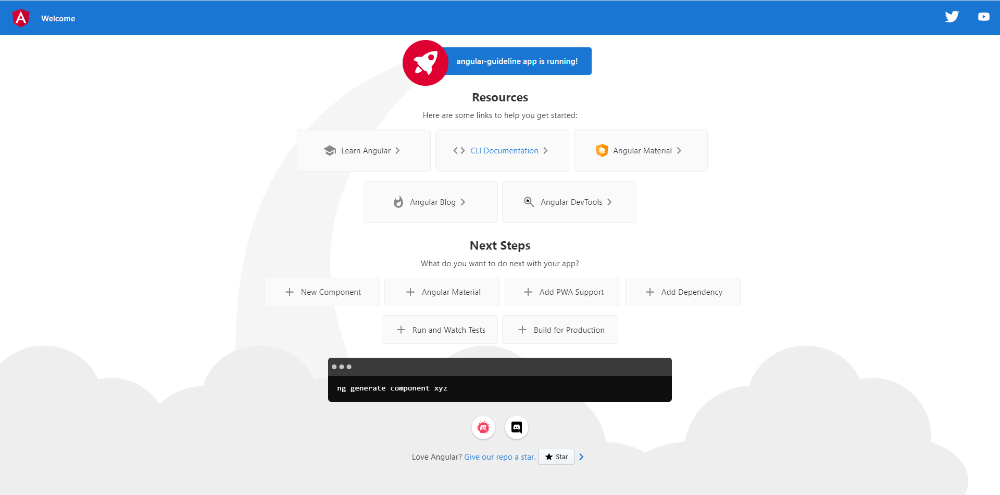
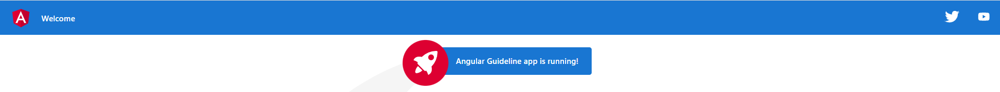

# Angular Guideline / Panduan Belajar Angular

This project was generated with [Angular CLI](https://github.com/angular/angular-cli) version 14.2.6.

## 1. Angular Introduction

### Sub Materi

1. Memahami NPM CLI terkait Angular
2. Memahami Angular CLI terkait project Angular
3. Menjalankan project Angular sampai bisa di akses dari browser
4. Memahami proses live reloading pada Angular saat terjadi perubahan code
5. Memahami struktur folder Angular

#### 1.1 Memahami NPM CLI terkait Angular

`The Angular CLI` adalah sebuah _command-line interface tool_ yang digunakan untuk _initialize,develop,scaffold_ dan _maintain_ aplikasi Angular.

Di awal kita sudah melakukan instalasi CLI yaitu dengan perintah berikut

```
npm install -g @angular/cli
```

Jika sudah bisa lakukan uji coba apakah CLI sudah benar terinstall atau belum dengan perintah `ng version`. Jika sudah maka akan mengeluarkan output seperti berikut.

```

     _                      _                 ____ _     ___
    / \   _ __   __ _ _   _| | __ _ _ __     / ___| |   |_ _|
   / △ \ | '_ \ / _` | | | | |/ _` | '__|   | |   | |    | |
  / ___ \| | | | (_| | |_| | | (_| | |      | |___| |___ | |
 /_/   \_\_| |_|\__, |\__,_|_|\__,_|_|       \____|_____|___|
                |___/


Angular CLI: 14.2.6
Node: 16.17.1
Package Manager: npm 8.15.0
OS: win32 x64

Angular: 14.2.6
... animations, cli, common, compiler, compiler-cli, core, forms
... platform-browser, platform-browser-dynamic, router

Package                         Version
---------------------------------------------------------
@angular-devkit/architect       0.1402.6
@angular-devkit/build-angular   14.2.6
@angular-devkit/core            14.2.6
@angular-devkit/schematics      14.2.6
@schematics/angular             14.2.6
rxjs                            7.5.7
typescript                      4.7.4
```

#### 1.2 Memahami Angular CLI terkait project Angular

Penggunaan CLI pada Angular saat banyak manfaat nya seperti yang dijelaskan sebelumnya. Silahkan untuk mengecek apa saja yang dapat di lakukan CLI dengan perintah `ng help` selanjutnya akan keluar informasi berikut.

```
ng <command>

Commands:
  ng add <collection>            Adds support for an external library to your project.
  ng analytics                   Configures the gathering of Angular CLI usage metrics. See https://angular.io/cli/usage-analytics-gathering
  ng build [project]             Compiles an Angular application or library into an output directory named dist/ at the given output path.                                [aliases: b]  ng cache                       Configure persistent disk cache and retrieve cache statistics.
  ng completion                  Set up Angular CLI autocompletion for your terminal.
  ng config [json-path] [value]  Retrieves or sets Angular configuration values in the angular.json file for the workspace.
  ng deploy [project]            Invokes the deploy builder for a specified project or for the default project in the workspace.
  ng doc <keyword>               Opens the official Angular documentation (angular.io) in a browser, and searches for a given keyword.                                    [aliases: d]  ng e2e [project]               Builds and serves an Angular application, then runs end-to-end tests.                                                                    [aliases: e]  ng extract-i18n [project]      Extracts i18n messages from source code.
  ng generate                    Generates and/or modifies files based on a schematic.                                                                                    [aliases: g]  ng lint [project]              Runs linting tools on Angular application code in a given project folder.
  ng new [name]                  Creates a new Angular workspace.                                                                                                         [aliases: n]  ng run <target>                Runs an Architect target with an optional custom builder configuration defined in your project.
  ng serve [project]             Builds and serves your application, rebuilding on file changes.                                                                          [aliases: s]  ng test [project]              Runs unit tests in a project.                                                                                                            [aliases: t]  ng update [packages..]         Updates your workspace and its dependencies. See https://update.angular.io/.
  ng version                     Outputs Angular CLI version.
```

Ada begitu banyak yang dapat dilakukan tetapi disini kita tidak akan mencoba semuanya. Beberapa yang perlu di coba di antaranya sebagai berikut.

- ng add
- ng generate
- ng build
- ng serve
- ng test

#### 1.2.1 `ng add`

`ng add` berfungsi untuk menambahkan sebuah eksternal library kedalam project yang kita buat, misalnya kita ingin menambahkan styling menggunakan bootstrap.

```
ng add @ng-bootstrap/ng-bootstrap
```

Untuk penjelasan lebih lengkap akan di bahas pada topik **Angular View Styling with Bootstrap**.

#### 1.2.2 `ng generate`

`ng generate` atau `ng g` berfungsi untuk melakukan Generates and/or modifies files based on a schematic. Beberapa command yang dapat di hasilkan adalah sebagai berikut.

- app-shell
- application
- class
- component
- directives
- enum
- guard
- interceptor
- interface
- libarary
- module
- pipe
- resolver
- service
- service-worker
- web-worker

Di atas beberapa command yang disediakan tetapi tidak semua kita gunakan. Berikut yang akan di gunakan.

- component
- directive
- guard
- interceptor
- module
- pipe
- service

#### 1.2.2.1 `ng generate component`

`ng generate component` atau `ng g c` berfungsi untuk membuat component baru pada project yang kita buat. `Component` itu sendiri merupakan bagian terpenting pada Angular, pembahasan lebih lanjut menganai `Component` akan di bahas pada topik **Angular Component**.

Cara penggunaannya adalah sebagai berikut (ini hanya contoh).

```
$ ng generate component sample-component
CREATE src/app/sample-component/sample-component.component.html (31 bytes)
CREATE src/app/sample-component/sample-component.component.spec.ts (663 bytes)
CREATE src/app/sample-component/sample-component.component.ts (315 bytes)
CREATE src/app/sample-component/sample-component.component.scss (0 bytes)
UPDATE src/app/app.module.ts (434 bytes)
```

Secara default akan membuat 4 (empat) buah file didalam folder sesuai component yang kita buat yaitu:

1. `sample-component.component.html` berisikan file html untuk tampilan di browser
2. `sample-component.component.spec.ts` berisikan file untuk kebutuhan unit testing
3. `sample-component.component.ts` berisikan file untuk logic pada component tersebut
4. `sample-component.component.scss` berisikan file untuk styling pada component tersebut

#### 1.2.2.2 `ng generate directive`

`ng generate directive` atau `ng g d` berfungsi untuk membuat directive baru pada project yang kita buat. `Directive` itu sendiri merupakan sebuah class tambahan di elemen Angular, pembahasan lebih lanjut menganai `Directive` akan di bahas pada topik **Angular Directive**.

Cara penggunaannya adalah sebagai berikut (ini hanya contoh).

```
$ ng g d sample-directive
CREATE src/app/sample-directive.directive.spec.ts (261 bytes)
CREATE src/app/sample-directive.directive.ts (159 bytes)
UPDATE src/app/app.module.ts (537 bytes)
```

Secara default akan membuat 2 (dua) buah file yaitu:

1. `sample-directive.directive.spec.ts` berisikan file untuk logic directive
2. `sample-directive.directive.ts` berisikan file untuk kebutuhan unit testing pada directive

Untuk yang lainnya seperti `guard`,`interceptor`,`module`,`pipe` dan `service` akan dibahas pada topic nya.

#### 1.3 Menjalankan project Angular sampai bisa di akses dari browser

Untuk menjalankan project angular kita dapat mealukan perintah berikut `ng serve`

```
Angular Live Development Server is listening on localhost:4200, open your browser on http://localhost:4200/ **
```

Buka browser di url `localhost:4200` (default port dari Angular adalah `:4200`) hasilnya adalah sebagai berikut.


Cara lain adalah secara otomatis akan membuka browser dengan perintah berikut `ng serve --open`

Bagaimana jika kita ingin custom port tidak sesuai default yang diberikan ? caranya adalah dengan perintah berikut `ng serve --port=4444 --open`

#### 1.4 Memahami proses live reloading pada Angular saat terjadi perubahan code

**Live Reloading** adalah ketika ada perubahan pada code maka secara otomatis di tampilan browser akan ikut berubah sesuai dnegan perubahan yang di lakukan. Fitur ini sangat membantu sekali dalam membangun dan mengembangkan project Angular. Kita tidak perlu melakukan restart project atau menjalankan ulang dengan `ng serve`.

Untuk contoh kita akan mencoba melakukan perubahan pada bagian bertuliskan `angular-guideline app is running` pastikan dahulu project sudah berjalan dengan perintah `ng serve`.

Buka file `src/app/app.component.html` kita lihat dahulu letak tulisan `angular-guideline app is running` jika tidak ada perubahan letak tulisan tersebut berada pada baris ke `344`.

```html
<span>{{ title }} app is running!</span>
```

Jika diperhartikan `angular-guideline` tidak ada pada baris kode tersebut yang ada hanyalah `{{title}}`. Jangan bingung kenapa seperti itu, contoh penggunaan tersebut adalah `string interpolation` atau transfer data dari `component.ts` ke view dimana data yang dikirim dari file `src/app/app.component.ts`. Jika kita buka file tersebut maka akan ada variable `title` dengan isi `angular-guideline`.

```ts
export class AppComponent {
  title = "angular-guideline";
}
```

Sekarang kita ubah misalnya pada bagian `title` menjadi `Angular Guideline` dan perhatikan jika kita simpan secara otomatis pada browser akan ikut berubah.


#### 1.5 Memahami struktur folder Angular

```bash
├── node_modules
├── src
│   ├── app
│   │   ├── app.component.html
|   |   ├── app.component.scss
|   |   ├── app.component.spec.ts
|   |   ├── app.component.ts
│   ├── assets
│   ├── environments
|   |   ├── environment.prod.ts
|   |   ├── environment.ts
│   ├── favicon.ico
│   ├── index.html
│   ├── main.ts
│   ├── polyfills.ts
│   ├── styles.scss
│   ├── test.ts
├── .browserslistrc
├── .editorconfig
├── .gitignore
├── angular.json
├── karma.conf.json
├── package-lock.json
├── package.json
├── README.md
├── tsconfig.app.json
├── tsconfig.json
└── tsconfig.spec.json
```

Penjelasan:

- `.editorconfig` untuk mengkonfigurasikan code editor.
- `src` disini adalah tempat semua file project di buat dari component, guard, service sampai dengan module.
- `angular.json` adalah sebuah CLI Configuration atau konfigurasi proyek Angular yang didalamnya terdiri dari untuk `build`, `serve`, `styling`, `testing` dan lain lain.
- `package.json` adalah file konfigurasi `npm` dan tempat dependency dibutuhkan pada project.
- `tsconfig.json` adalah file konfigurasi untuk TypeScript.
- `karma.conf.json` adalah file konfigurasi untuk testing.

Untuk lebih jelas kita akan membuka file dari `angular.json`.

```json
{
  "$schema": "./node_modules/@angular/cli/lib/config/schema.json",
  "version": 1,
  "newProjectRoot": "projects",
  "projects": {
    "angular-guideline": {
      "projectType": "application",
      "schematics": {
        "@schematics/angular:component": {
          "style": "scss"
        }
      },
      "root": "",
      "sourceRoot": "src",
      "prefix": "app",
      "architect": {
        "build": {
          "builder": "@angular-devkit/build-angular:browser",
          "options": {
            "outputPath": "dist/angular-guideline",
            "index": "src/index.html",
            "main": "src/main.ts",
            "polyfills": "src/polyfills.ts",
            "tsConfig": "tsconfig.app.json",
            "inlineStyleLanguage": "scss",
            "assets": ["src/favicon.ico", "src/assets"],
            "styles": ["src/styles.scss"],
            "scripts": []
          },
          "configurations": {
            "production": {
              "budgets": [
                {
                  "type": "initial",
                  "maximumWarning": "500kb",
                  "maximumError": "1mb"
                },
                {
                  "type": "anyComponentStyle",
                  "maximumWarning": "2kb",
                  "maximumError": "4kb"
                }
              ],
              "fileReplacements": [
                {
                  "replace": "src/environments/environment.ts",
                  "with": "src/environments/environment.prod.ts"
                }
              ],
              "outputHashing": "all"
            },
            "development": {
              "buildOptimizer": false,
              "optimization": false,
              "vendorChunk": true,
              "extractLicenses": false,
              "sourceMap": true,
              "namedChunks": true
            }
          },
          "defaultConfiguration": "production"
        },
        "serve": {
          "builder": "@angular-devkit/build-angular:dev-server",
          "configurations": {
            "production": {
              "browserTarget": "angular-guideline:build:production"
            },
            "development": {
              "browserTarget": "angular-guideline:build:development"
            }
          },
          "defaultConfiguration": "development"
        },
        "extract-i18n": {
          "builder": "@angular-devkit/build-angular:extract-i18n",
          "options": {
            "browserTarget": "angular-guideline:build"
          }
        },
        "test": {
          "builder": "@angular-devkit/build-angular:karma",
          "options": {
            "main": "src/test.ts",
            "polyfills": "src/polyfills.ts",
            "tsConfig": "tsconfig.spec.json",
            "karmaConfig": "karma.conf.js",
            "inlineStyleLanguage": "scss",
            "assets": ["src/favicon.ico", "src/assets"],
            "styles": ["src/styles.scss"],
            "scripts": []
          }
        }
      }
    }
  },
  "cli": {
    "analytics": "ced87060-f221-453f-8010-74baea6ddcd2"
  }
}
```

Beberapa bagian penting dalam file `angular.json` adalah:

1. Bagian styling kita menggunakan apa dan dapat diubah sesuai dengan kebutuhan.

```json
"projects": {
  "schematics": {
    "@schematics/angular:component": {
      "style": "scss"
      }
    },
}
```

2. Bagian root project dan prefix pada sebuah component.

```json
"sourceRoot": "src",
"prefix": "app",
```

Prefix pada sebuah component maksudnya adalah ketika kita membuah sebuah component maka pada bagian `selector` akan terdapat prefix `app` _e.g_ `app-root`, `app-sample-component` dll.

```ts
@Component({
  selector: 'app-root',
})
```

3. Selanjutnya bagian `architect` ini untuk pengaturan `styling`, `scripting`.

```json
"architect": {
  "build": {
    "options": {
      "outputPath": "dist/angular-guideline",
      "index": "src/index.html",
      "main": "src/main.ts",
      "polyfills": "src/polyfills.ts",
      "tsConfig": "tsconfig.app.json",
      "inlineStyleLanguage": "scss",
      "assets": ["src/favicon.ico", "src/assets"],
      "styles": ["src/styles.scss"],
      "scripts": []
    },
  }
}
```

Di atas juga terdapat pengaturan dimana letak `output path`, `tsconfig`, `assets` untuk file seperti icon, gambar `styles` untuk styling `scripts` untuk file js

Beberapa bagian penting dalam folder `src` terdapat beberapa sub folder diantaranya `assets` untuk penyimpanan file-file yang dibutuhkan misalnya gambar, `environment` konfigurasi project env (akan di bahas kemudian).

Kemudian ada folder `app`. Pada folder ini semua component akan tersimpan disini termasuk service (akan di bahas lebih lanjut pada topik yang bersangkutan)

---

Dibuat oleh:

- Jution Candra Kirana
